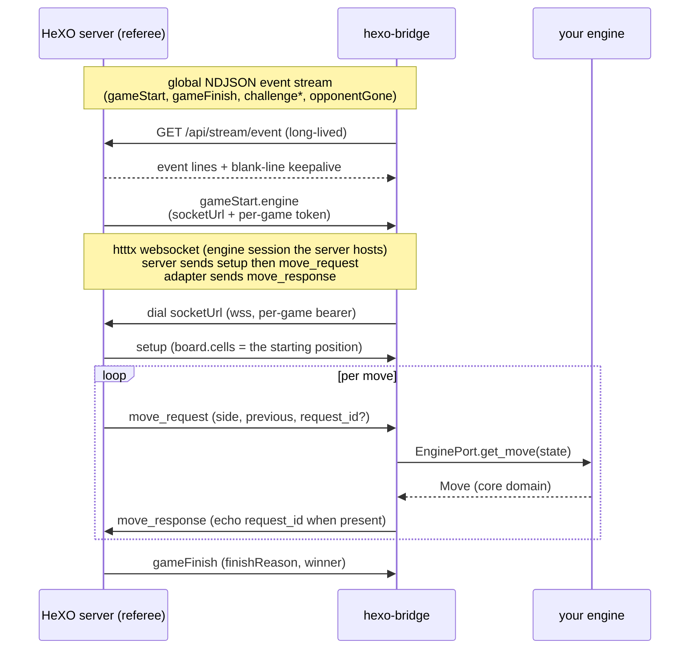

# Data flow

Which side owns what. Read this once to know where to look when something goes
wrong.

## Two layers, one bridge

## HeXO lifecycle vs engine session

The HeXO server owns the lifecycle: pairing, challenges, the global event
stream, game start and finish. The bridge opens one long-lived global stream
per process and dispatches `gameStart` to a per-game task.

The engine session is per-game. On `gameStart` the server hands the bridge a
`socketUrl` and a short-lived per-game token. The bridge dials it and plays that
one game over it. When the game ends the server closes the socket and emits
`gameFinish` on the global stream. The bridge does not open a second stream per
game.

## Who owns what

| Concern | Owner |
| --- | --- |
| Pairing, challenges, ratings | HeXO server |
| Clocks (turn / match time control) | HeXO server |
| Move legality | HeXO server |
| The illegal-move forfeit (`finishReason: illegal-move`) | HeXO server |
| The engine session (`socketUrl`) | HeXO server (hosted), adapter (dialed) |
| Computing a move | your engine (`EnginePort`) |
| Mapping `p1`/`p2` to `x`/`o` | the bridge, at the boundary |
| Reconnecting the global stream | the bridge, with backoff |
| Reconnecting a dropped engine session | the bridge, via a fresh `gameStart` on reconnect |

The bridge does not adjudicate. It never resigns after a rejected move (there is
no move POST to reject). On a bridge-side translation error it does not send a
move, so the server times the side out on its own terms; a genuine engine move
that the server rejects as illegal ends the game server-side.

## Retry safety

There is no HeXO move POST, so there is no CAS `ply` to guard. The "a resent
move cannot double-apply" property lives in htttx answer-matching on the engine
session, and is exactly as open as the htttx spec:

- When the server assigns a `request_id` (the bot declares the
  `basic_websocket.v1-alpha.request_id` capability): the server assigns a
  strictly-increasing id per `move_request`; the adapter echoes it unchanged on
  the answering `move_response`; the server discards any response whose id is
  not the outstanding one; an `interrupt` invalidates the outstanding request
  and a late answer is dropped.
- When the server does not assign ids (a conformant positional-only server, or
  a bot that does not declare the capability): the adapter correlates
  positionally. At most one move request is outstanding at a time, so any
  answer while a request is outstanding is the answer.

The `HtttxWebsocketSession` adapter goes one step further and drops a stale
(interrupted) or mismatched (reordered) answer locally rather than sending it,
in both modes. If the bot declares `basic_websocket.v1-alpha.request_id` in its
capabilities, set `require_request_id = true` in `[engine_session.options]` and
the adapter will also drop any `move_request` that arrives without an id. See
`examples/config.websocket-session.toml`.

## Server neutrality

The bridge conforms to the open spec, not to any one server:

- Board: built from the `setup` packet the server delivers (`setup.board.cells`),
  replayed with the cumulative moves. The standard server delivers one cross at
  the origin there; a conformant server may deliver a different starting
  position under `free_setup`, and the bridge plays it as delivered. No origin
  is baked in.
- Side to move: taken from `move_request.side` (the server states it), not
  derived from ply parity or an origin convention.
- request_id: echoed when the server sends one; correlated positionally when it
  does not. The bridge plays a positional-only conformant server to completion.

## The engine alphabet vs the platform alphabet

Core speaks the htttx engine alphabet: `x` (crosses) and `o` (circles). The
HeXO platform surface speaks play order: `p1` and `p2`. The platform adapter
maps between them at the boundary; core never sees `p1`/`p2`. Your engine
returns `x`/`o` moves; the bridge sends them over the engine session unchanged.
